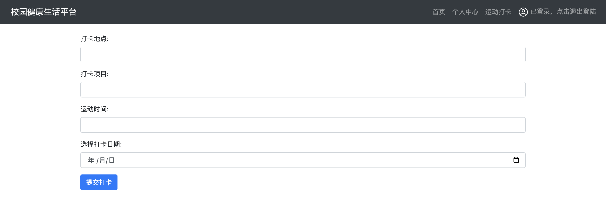
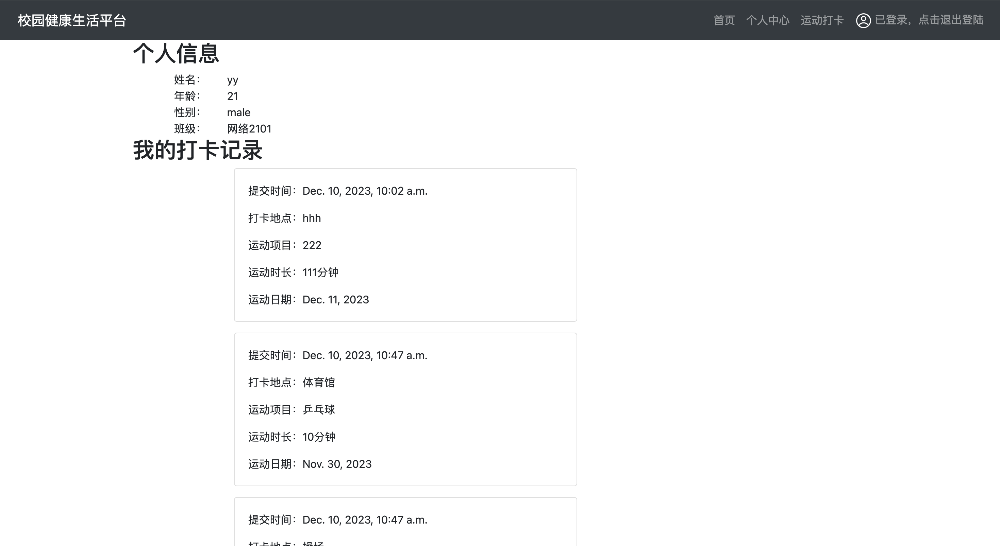

# 基于Django的校园健康生活平台

>  理塘最速传说と绝凶の猛虎

## 用户管理
- 普通用户：学生。
- 超级管理员：后勤老师（用了Django自带的超级管理员界面），负责数据的查看和上传。

## 数据库设计
> 这里是我感受最深的地方，首先是因为大部分的bug都是这里报出来的，其次是回忆起了上学期的数据库课程讲的很多知识。

由于功能简单，表也比较少，最后结果其实就是`User`,`UserProfile`和`ExerciseLog`。

| 模型           | 主键          | 外键                      | 关联模型         | 外键约束                   |
| -------------- | ------------- | ------------------------- | ---------------- | -------------------------- |
| User           | id            | 无                        | 无               | 无                         |
| UserProfile    | id            | user (User 的主键)        | User             | on_delete=models.CASCADE   |
| ExerciseLog    | id            | user_profile (UserProfile 的主键) | UserProfile  | on_delete=models.CASCADE   |

- `UserProfile` 与 `User` 是一对一关系，通过 `user` 字段建立关联。
- `ExerciseLog` 与 `UserProfile` 是多对一关系，通过 `user_profile` 字段建立关联。

`UserProfile`像是一个中间模型，来连接`User`和`ExerciseLog`，但似乎直接连接`User`和`ExerciseLog`也是可行的。这就让我想起数据库课程上讲的ER关系图，当两种方法都可以时，我们就要考虑系统的可维护性、灵活性，`User`更偏向身份认证、登陆时使用，当用户信息更复杂时，我认为可以通过这样一个`UserProfile`来和其他表建立起联系。具体来说当我想统计一个班有多少人进行了体育打卡时，采用这种设计肯定是更为合理的。

## 平台功能&实现技术

### 首页新闻功能
爬取了[中国疾病预防控制中心](https://www.chinacdc.cn/)网站的新闻，利用`bootstrap`框架实现了新闻的展示与滚动。

用户可以点击图片跳转至对应新闻原文页。


运行`get_news.py`后会在`/health/static/news`下产生`json`格式文件。`views.py`中定义了`news`视图，用来读取`json`文件中内容，实现了接口分离。
> 一开始在index.html中想在<head>中写一段js来加载，但是Django这个模版继承整的我有点晕。。。js一直不加载，后面就干脆Django一用到底。

> 还有个想吐槽的是，这样封装了一下数据接口，json数据传来传去整出来url编码了，各种问题百出，这里暂时没有解决，所以index视图下并没有使用`data=news(request)`，直接赋值了。

### 用户注册与登陆

采用`Django`的`models`中自带的`User`类实现用户注册、登陆、退出登陆。

前端页面中用户登陆状态同样采用`Django`框架下的模版继承来动态管理。
```python
# views.py
is_user_logged_in = request.user.is_authenticated
context = {
        'is_user_logged_in': is_user_logged_in
}

return render(request, 'index.html', context)
```

```html
<!-- layout.html -->

    <a class="nav-link" href="">
        
        <span id="login-status-text">已登录，点击退出登陆</span>
    </a>

    <a class="nav-link" href="">
        
        <span id="login-status-text">未登录</span>
    </a>

```

### 运动打卡
用`POST`表单进行数据收集。


### 个人页面
用来展示个人信息和打卡信息。

唯一值得一提的就是外键过滤。

`exercise_logs = ExerciseLog.objects.filter(user_profile__user=current_user)`
